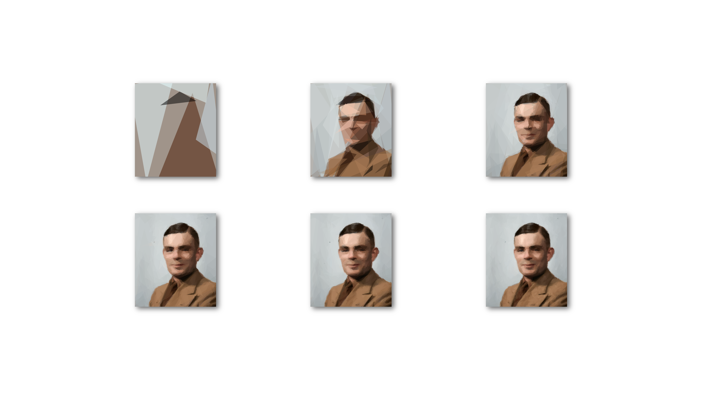

# geometricArt

  

A set of images created with [primitive](https://github.com/fogleman/primitive) featuring Ada Lovelace and Alan Turing. Those are progressions using `-n = 10i³`, where i goes from 1 to 7.

